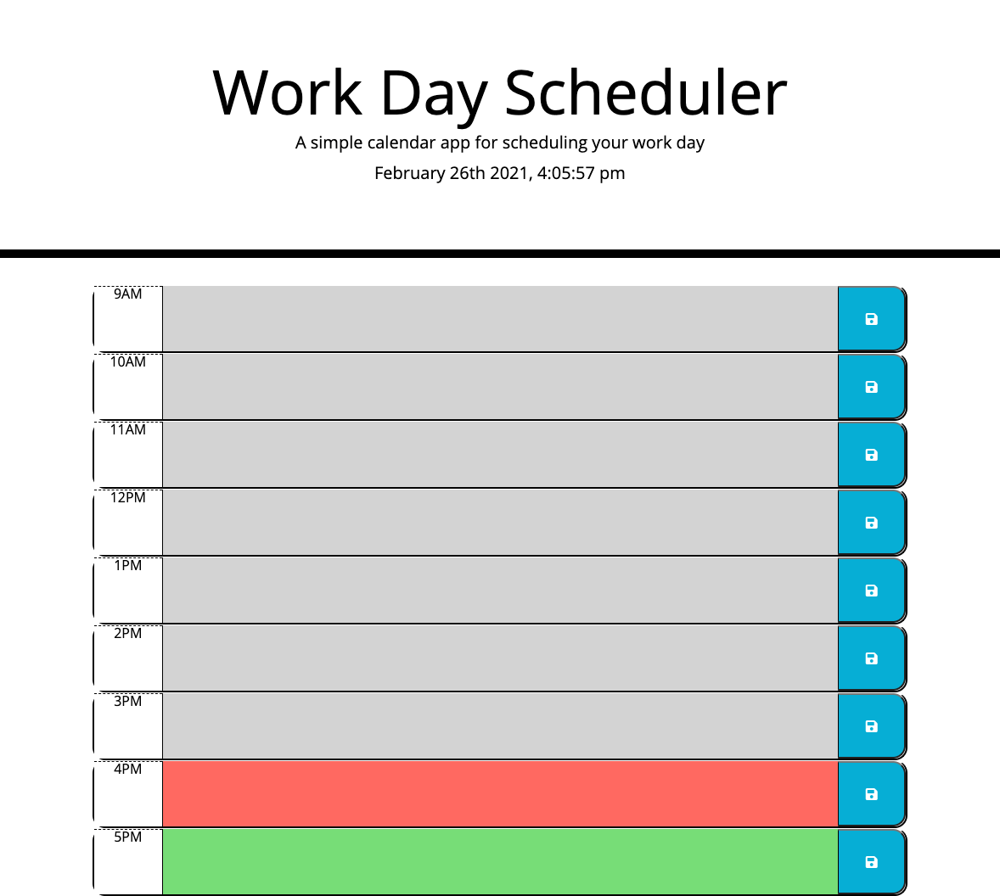

# Work-Day-Planner

https://stefanpodz303.github.io/Work-Day-Planner/

## Purpose and Description of Work
-- Created a work day scheduling planner using some html and css starter code and JS from scratch.
-- The planner allows the user to input tasks or reminders in time blocks and save it to local storage and revist the web page throughtout the day and see them displayed.
-- The time blocks have also been color coded to display "past, present and future" times on the planner.
-- The planner also displays the current date and time on the page and keeps track of it in real-time. 